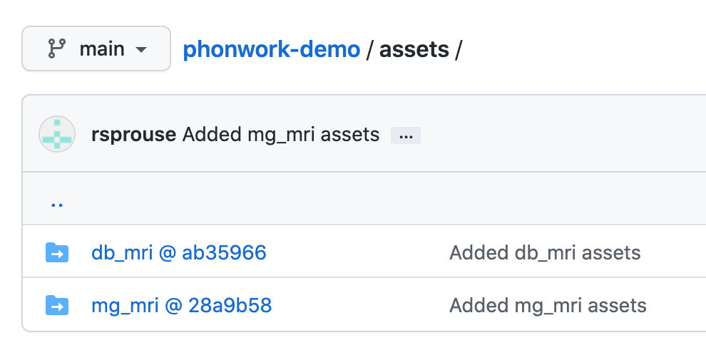

# phonwork-demo
Demo of phonwork with submodules

## Cloning

Media files are in git submodules and can be downloaded when cloning this repository, or you can clone without downloading the media files, in which case each submodule can be selected for download later.

### Cloning with all media files

To clone the entire repo, including the contents of the asset submodules, do:

```bash
git clone https://github.com/rsprouse/phonwork-demo --recurse-submodules
```

### Cloning without downloading all media files

To get the phonwork-demo repo *without* the asset submodules:

```bash
git clone https://github.com/rsprouse/phonwork-demo
```

After running the above command the `assets/db_mri` and `assets/mg_mri` subdirectories exist but are empty. To get assets for one or more submodules use `git submodule update --init` and specify the desired asset path:

```bash
git submodule update --init assets/db_mri
git submodule update --init assets/mg_mri
```

Now the asset subdirectories are no longer empty.

## Adding submodules

Examples of adding submodules:

```bash
git submodule add https://github.com/rsprouse/phonwork-db_mri assets/db_mri
git add .gitmodules
git add assets/db_mri
git commit -m 'Added db_mri assets'

git submodule add https://github.com/rsprouse/phonwork-mg_mri assets/mg_mri
git add .gitmodules
git add assets/mg_mri
git commit -m 'Added mg_mri assets'
```

Note that pointers to these submodule repos are to specific versions, as indicated by the SHA, which you can see on github with the `@ SHA`:



On your local filesystem these directories will just be `db_mri` and `mg_mri`; the `@ SHA` will not be part of the directory names.

## Updating submodules

Since each submodule points to a particular version of an asset repo, it is necessary to update the submodule reference to keep up with changes to the asset repos. When files have been added/deleted/modified in an asset repo, update with the following, using an appropriate value for `REPO` (e.g. `db_mri`):

```bash
git submodule update --init assets/REPO
cd assets/REPO
git pull origin main
cd ../..
git add assets/REPO
git commit -m 'Update REPO assets'
git push
```
